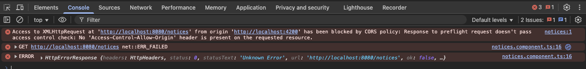
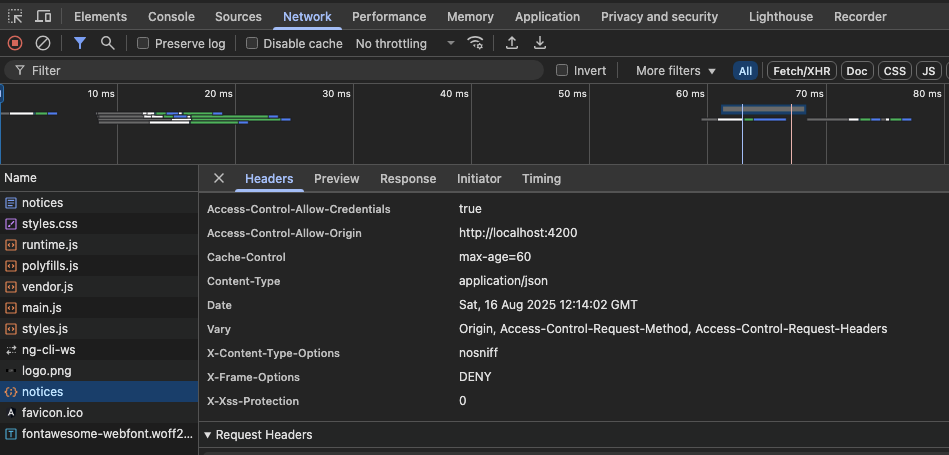

## 들어가며
웹 개발자라면 개발 시 꼭 한번 부딪히는 문제인 CORS, 프론트엔드 Frontend, Backend를 연결하는 과정에서 콘솔 창에서 아래 에러를 한 번쯤 봤을 것이다.

대부분 Spring에서 기본적으로 제공하는 주석인 `@CrossOrigin`이나 혹은 `Spring Security`로 설정을 하는 경우가 대부분이다. 해당 부분에 대해 정확히 어떤 원리로 동작하는 지 이해해보자.

## CORS가 뭔데?
`Cross-Origin-Resource-Sharing`의 약자로, 웹 브라우저에서 자신의 브라우저 출처가 아닌, 다른 출처에서(domain, port 포함) 자원을 로딩하는 것을 제어하는 규칙이다. <br />


기본적으로 브라우저는 `Same Origin Policy`가 적용되어있는데, 동일한 출처의 자원만 로딩이 가능하다. 
이 때, `Postman`으로 요청을 보냈을 땐 응답이 잘 오는데 브라우저에서는 안되는 이유도 `Postman`은 브라우저가 아니므로 `Same Origin Policy` 제약이 존재하지 않기 때문이다. 

위의 에러 사진에서 발견할 수 있듯이, `localhost:8080/notices`와 `localhost:4200` 사이 간의 요청은 기본적으로 제한되어 있는 것을 확인할 수 있다.

여기서 참고할 점은 CORS는 해킹 공격을 막기 위한 **보안 장치**라기보다는, 브라우저가 기본적으로 교차 출처 간의 데이터를 공유하지 않도록 **선제적으로 차단하는 보호 기능**에 가깝다.

## 브라우저는 어떻게 동작할까 ?
프론트엔드에서 API 요청을 보내면, 브라우저는 단순히 서버로 요청을 보내지 않고, 다른 출처로 (Origin) 요청을 보내는 걸 감지하는 순간, 먼저 `Preflight` 요청을 보낸다. 
* `Preflight` 요청을 통해 서버가 해당 요청을 받아줄 준비가 되어있는지 선제적으로 확인한다.
* 서버에서 올바른 CORS 응답 헤더 (Access-Control-Allow-Origin)을 내려주면, 실제 API 요청이 진행된다.

### 예시 응답헤더
```
Access-Control-Allow-Origin: http://localhost:4200
Access-Control-Allow-Methods: GET, POST, PUT, DELETE
Access-Control-Allow-Headers: Content-Type, Authorization
Access-Control-Allow-Credentials: true
```

### API 응답



## Reference
- [MDN Web Docs](https://developer.mozilla.org/ko/docs/Web/HTTP/Guides/CORS)
- [Udemy Lecture](https://www.udemy.com/course/spring-security-6-jwt-oauth2-korean/?couponCode=KEEPLEARNING)