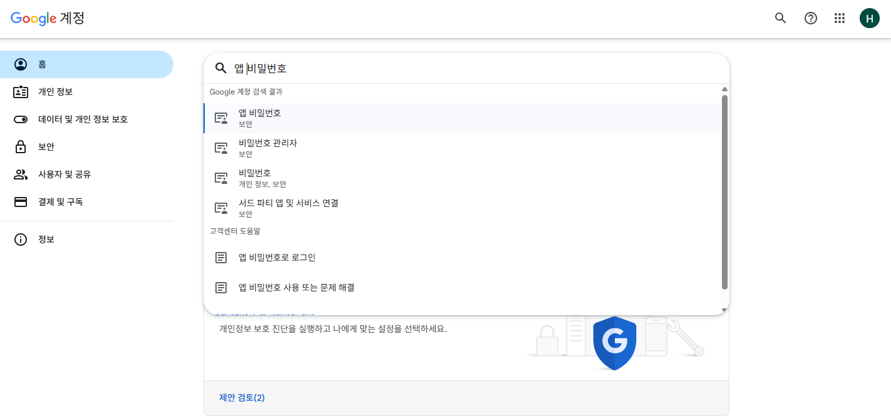
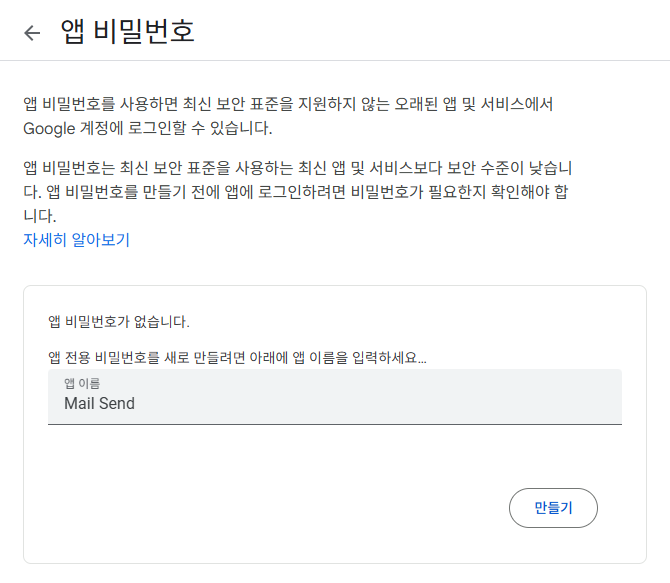
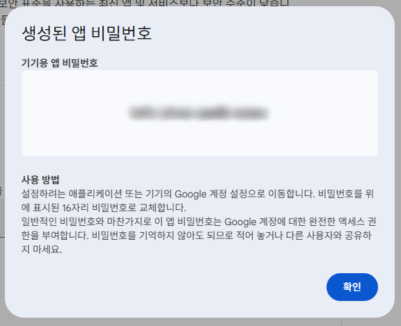
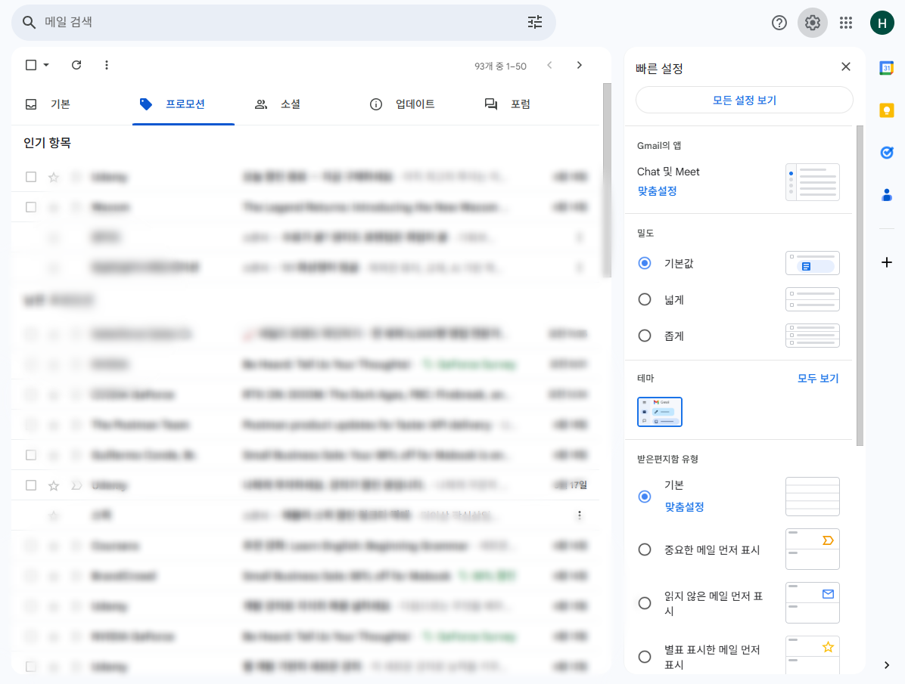
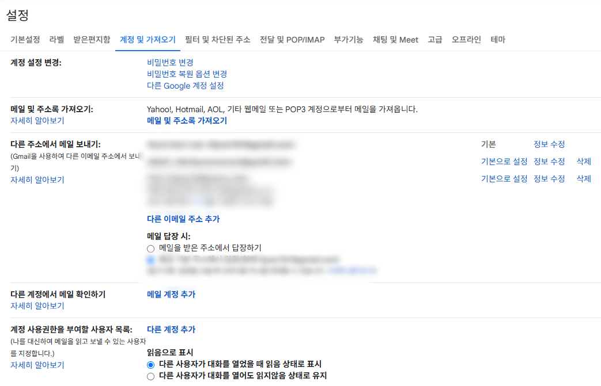
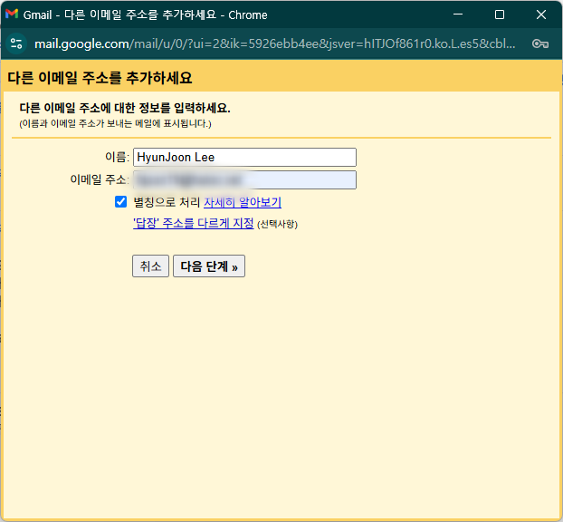
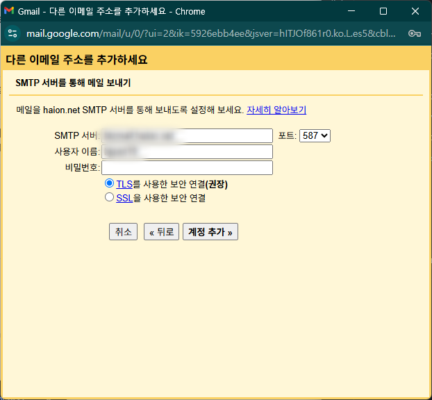
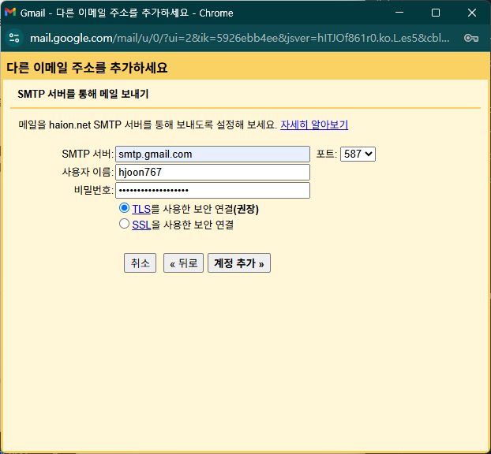
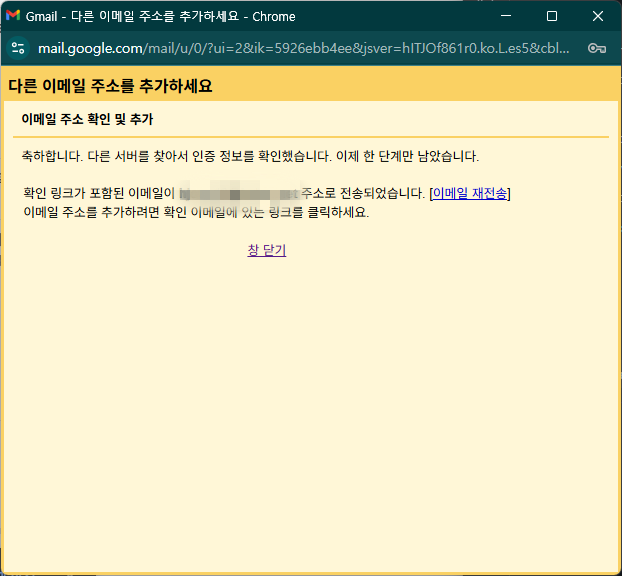
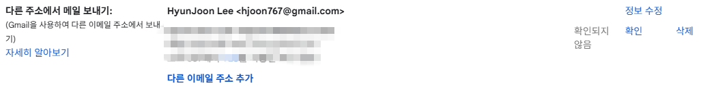

## ﹖ 이걸 생각하게 된 이유
- 현재 진행 중인 프로젝트에서 간단하게 **거래명세서를 이메일 전송하는 기능**이 필요했다.
- 구현은 간단하게 할 수 있었으나 회의 중 발신자 이메일을 기본 Gmail이 아닌 회사 domain 이메일 주소로 변경하는 수요가 생겼다
    - `hjoon19@gmail.com` -> `hjoon19@domain.com`
- 실제 구현한 과정을 정리해두고 헤매는 사람들에게 도움이 되기를 바라는 마음으로 작성하게 되었다.

## ✅ 예시
- 먼저 Controller, Service 단의 기본 로직을 구성했다.
- 받는 파라미터는 다음 세 가지로 간단하게 구성했다.
    - 받는 사람 이메일 주소
    - 거래처 이름
    - 거래처 담당자 이름
      이후에는 첨부파일도 함께 보내는 기능을 추가할 예정이지만, 이번 글에서는 발신자 이메일 변경까지의 과정만 다룬다.
```java title="EmailController"
@RestController
@RequiredArgsConstructor
@RequestMapping("/email")
public class EmailController {

  private final EmailService emailService;

  @PostMapping("/statement")
  public String sendEmailWithAttachment(@RequestParam String to, @RequestParam String custnm,
                                        @RequestParam String name) throws MessagingException {

   emailService.sendMessageWithAttachment(to, custnm, name);

   return "success";
  }
}
```

```java title="EmailService"
@Service
@RequiredArgsConstructor
public class EmailService {

    private final JavaMailSender mailSender;
    private final SpringTemplateEngine templateEngine;

    public void sendMessageWithAttachment(String to, String custnm, String name) throws MessagingException {

        MimeMessage message = mailSender.createMimeMessage();
        MimeMessageHelper helper = new MimeMessageHelper(message, true, "utf-8");

        Context context = new Context();
        context.setVariable("custnm", custnm);
        context.setVariable("name", name);
        context.setVariable("to", to);

        String html = templateEngine.process("email/statement", context);
        helper.setTo(to);
        helper.setSubject("거래명세서 전달의 건");
        helper.setText(html, true);

        mailSender.send(message);
    }
}
```
- 타임리프(Thymeleaf) 템플릿을 사용하여 거래처 이름, 담당자 이름 등을 메일 본문에 반영했다.
- 지금은 구조 설명이 목적이므로, 템플릿 내용 자체는 넘어가자.

## 앱 비밀번호 설정
- 앱 비밀번호 설정
  
- 앱 이름 설정

  
- 앱 비밀번호 생성
  
  

## 설정
- Gmail에 들어가서 설정 -> 모든 설정 보기 클릭
  
- 계정 및 가져오기 에서 다른 이메일 주소 추가 클릭
  
- 원하는 이름 및 이메일 주소 입력
  
- 일반 Gmail이 아닌, 학교 및 직장 내 게정이라면 아래처럼 이런 창이 뜰 것이다.
  
- SMTP 서버는 `smtp.gmail.com`으로 지정
- 사용자 이름은 이전에 앱 비밀번호를 만든 gmail 계정의 앞 부분 작성
    - e.g.)Test1@gmail.com -> Test1
- 비밀번호는 앞 전에 생성한 앱 비밀번호를 넣어준다.
  
- 이제 전송된 메일을 확인하여 인증을 진행하면 완료
  
- 설정 창에서 확인해보면 잘 등록된 것을 확인할 수 있다.
  

## 코드 추가
- 이제 `service` 단 코드에서 `setFrom()`을 지정해주면 원하는 이메일 주소로 발신이 가능하다.

```java title="EmailService" {19} showLineNumbers{20-26}
@Service
@RequiredArgsConstructor
public class EmailService {

    private final JavaMailSender mailSender;
    private final SpringTemplateEngine templateEngine;

    public void sendMessageWithAttachment(String to, String custnm, String name) throws MessagingException {

        MimeMessage message = mailSender.createMimeMessage();
        MimeMessageHelper helper = new MimeMessageHelper(message, true, "utf-8");

        Context context = new Context();
        context.setVariable("custnm", custnm);
        context.setVariable("name", name);
        context.setVariable("to", to);

        String html = templateEngine.process("email/statement", context);
        helper.setFrom("hjoon19@haion.net");
        helper.setTo(to);
        helper.setSubject("거래명세서 전달의 건");
        helper.setText(html, true);

        mailSender.send(message);
    }
}
```

## 🙌 후기
- 블로그와 문서를 여기저기 찾아보며 삽질도 많이 했지만, 다음에 또 비슷한 작업을 할 때 큰 도움이 될 것 같다.
- 혹시 나처럼 **회사 도메인 이메일을 발신자로 지정**하고 싶은 분이 있다면, 이 글이 좋은 가이드가 되었으면 한다.