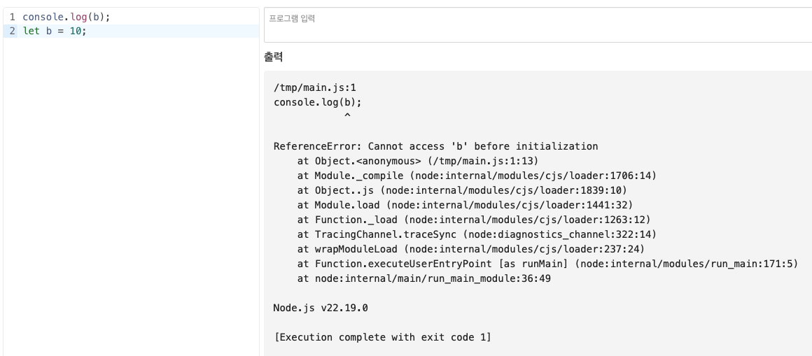

# 함수 선언 방식
JavaScript에서 대표적으로 함수를 선언하는 방법은 **function 키워드**와 **화살표 함수**이다.
두 방식은 문법뿐 아니라 동작 방식에서도 차이가 존재하기 때문에, 상황에 따라 적절히 선택하는 것이 중요하다.

## function

```javascript
function add(a, b) {
	return a + b;
};
```

- 호이스팅 (`hoisting`)이 적용되어, 함수 선언 이전에도 호출이 가능하다.
- 함수 내부에서의 `this`는 호출한 주체에 따라 동적으로 결정된다.
- `arguments` 객체를 사용할 수 있다.

## Arrow Function

```javascript
const add = (a, b) => {
	return a + b;
};

const. add = (a, b) => a + b;
```
- 호이스팅 (`hoisting`)이 적용되지 않는다.
- `this`를 새로 생성하지 않고, 상위 스코프의 `this`를 그대로 사용한다.
- `arguments` 객체를 사용할 수 없다.

## 차이점
### `this`

- `function` 함수 에서는 `this`는 누가 호출했는지에 따라 결정이 된다.
- 여기서는 `function` 으로 선언된 `getValue`가 호출되는 시점에서 `this`가 결정된다.
	- 즉, `this === obj` 이다.
```javascript
const obj = {
	value: 10,
	getValue: function() {
		console.log(this.value)
	}
}

obj.getValue(); // 10
```

- `this`를 새로 만들지 않고, 상위 스코프의 `this`를 그대로 사용한다.
	- 보통 전역 스코프에서 실행되기 때문에 실제 `this`는 `window`이다.
```javascript {3-5}
const obj = {
	value: 10,
	getValue: () => {
		console.log(this.value)
	}
}

obj.getValue(); // undefined
```

- 객체의 메서드를 화살표 함수로 만들면 `this`가 객체를 가리키지 않는다.
- 객체 메서드는 `function`, 콜백은 화살표 함수를 기본적으로 사용하는 것이 좋다.

```javascript {3-6}
const obj = {
	value: 10,
	getValue: function() {
		setTimeout(() => {
			console.log(this.value)
		}, 100)
	}
}

obj.getValue(); // 10
```
- 아니면 위의 예제처럼 바깥 `function`의 `this -> obj`를 이용하여, 안쪽의 화살표 함수는 그 `this`를 그대로 사용하도록 할 수 있다.
- 이것이 바로 상위 스코프의 `this`를 사용하는 것.

### 호이스팅 여부 (hoisting)

- `JavaScript`는 코드를 실행하기 전에 전체 코드를 훑는데, 거기서 변수 선언과 함수 선언을 먼저 메모리에 등록한다.
- 그 다음에 위에서부터 한 줄씩 실행한다. 즉, 끌어올려진 것이 아니라 메모리에 등록이 되는 것.
- 하지만 function 함수는 호이스팅이 되지만, 화살표 함수는 호이스팅이 되지 않는다. 왜일까?
#### function
```javascript
print();

function print() {
	console.log("hello")
};
```
- 위의 `print()`는 `JavaScript` 내부적으로 아래 처럼 해석한다.
```javascript
function print() {
	console.log("hello")
}

print();
```
- 함수 선언 자체가 호이스팅이 되기 때문에 선언 위치가 `function` 함수 보다 위에서 호출해도 상관이 없다.

#### Arrow Function
```javascript
print();

const print = () => {
	console.log("hello")
};
```
- 하지만 화살표 함수는 내부적으로 아래 처럼 해석한다.
```javascript
const print;
print();
print = () => {};
```
- 화살표 함수는 함수가 선언이 되는 것이 아니라 **변수 할당**이 되기 때문이다.

##### 변수 할당
- 좀 더 이해를 쉽게 하기 위해 예시를 들어보자.
- JavaScript 에서는 변수 선언으로 `var`, `let`, `const`가 있다.

**var**
```javascript
console.log(a)
var a = 10;
```
- 해당 코드에서 a 값은 `undefined`이며, 아래 처럼 해석이 된다.
```javascript
var a;
console.log(a)
a = 10;
```
- 선언만 호이스팅이 되며, 값 할당은 호이스팅이 되지 않는다.

**let/const**
```javascript
console.log(b);
let b = 10;
```
- 해당 코드는 바로 에러가 난다.

```text
Connot access 'b' before initialization
```
- `let`, `const`도 호이스팅은 된다고 볼 수 있지만, 초기화 되기 전까지 접근이 금지되기 때문이다.
- 즉, 호이스팅 되어 변수를 메모리에 올려놨지만, TDZ라는 지역에 있어 선언한 코드줄을 지나야 접근이 가능하다.
- 자세한 내용은 [잘 정리된 글](https://ccomccomhan.tistory.com/290)이 있으니 참고! 

### arguments 사용 가능 여부

#### function
```javascript
function sum() {
	const args = Array.from(arguments)
    return args.reduce((a, b) => a + b, 0)
}

console.log(sum(1, 2, 3)) // 6
```

#### Arrow Function
```javascript
const sum = () => {
	console.log(arguments) // X
};
```
- `argument` 대신, **rest parameter**인 `(...args)`를 사용
```javascript
const sum = (...args) => {
    return args.reduce((a, b) => a+b, 0)
}

console.log(sum(1,2,3)) // 6
```

**참고**
- `function`도 **rest parameter**인 `(...args)`를 사용할 수 있다.
```javascript
function sum(...args) {
	return args.reduce((a,b) => a+b, 0)
}

console.log(sum(1,2,3)) // 6
```
- 위에 선언한 `arguments` 방식은 예전 방식이므로 참고!

### 생성자 함수 사용 여부
#### function
```javascript
function User(name) {
	this.name = name;
}

const user = new User("Lee");
```

#### Arrow Function
```javascript
const User = (name) => {
	this.name = name;
}

const user = new User("Lee"); // X
```

# Reference  
- [호이스팅이란?](https://ccomccomhan.tistory.com/290)
- [myCompiler](https://www.mycompiler.io/ko/new/nodejs)
