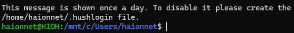
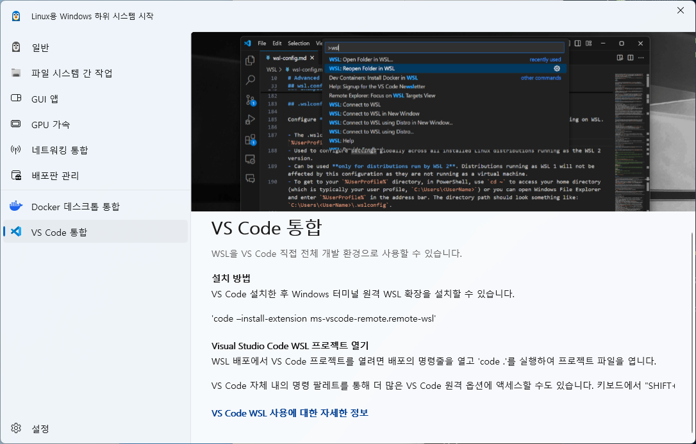

# WSL (Windows Subsystem for Linux)
* Windows에서 리눅스를 사용할 수 있게 해주는 기능
* 윈도우와 거의 통합되어 작동한다.
* 개발 도구를 (Node, java, Git 등) 리눅스 환경에서 쾌적하게 사용 가능

## 왜 쓸까 ?
* Windows는 리눅스와 개발 환경이 많이 다르다
* 대부분의 서버는 리눅스 기반이기 때문에 개발과 배포 환경을 일치시키기 위해서 사용한다.
* npm, docker, ssh 등 리눅스가 훨씬 편리하게 사용이 가능하다.

# 설치 방법
* WSL 2와 Ubuntu가 같이 자동으로 같이 설치 된다.

```powershell
wsl --install
```


* 설치 후 해당 명령어를 입력하면 사용자 이름 및 비밀번호를 설정한다.
* 설정이 끝나면 Ubuntu 셸이 열린다 (여기서부터 리눅스 환경이 된다!)
```powershell
wsl.exe -d Ubuntu
```


# 개발환경 세팅하기
* 설치가 완료되면, WSL Setting 을 열 수 있다.
* 여기서 VS Code 에 통합을 할 수 있는데 자세한 건 이미지를 살펴보자
  
```bash
code -install-extension ms-vscode-remote.remote-wsl
```
* 해당 명령어로 Window 터미널 원격 WSL 확장을 설치할 수 있다.