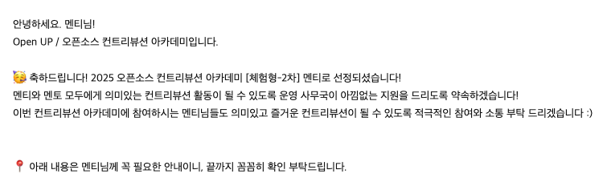
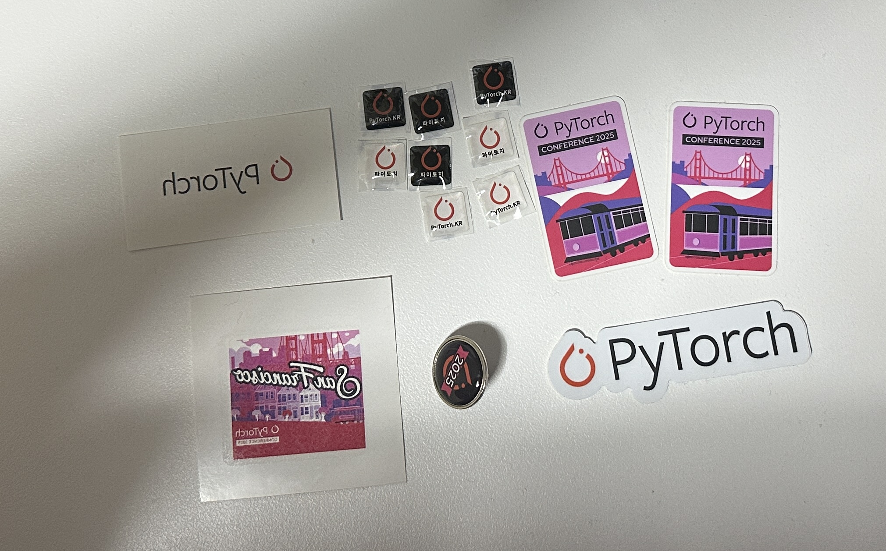

오픈소스 컨트리뷰터 아카데미에 참여하면서 [PyTorch 한국어 tutorial](https://github.com/PyTorchKorea/tutorials-kr) 번역에 기여할 기회를 얻었다.

개발자라면 공부하거나 문제 해결을 위해 공식 문서를 자주 참고하게 된다. 
하지만 대부분의 영어로 작성되어 있어, 영어에 익숙하지 않은 사람에게는 첫 번째 장벽이 되곤 한다. 
번역 도구가 많아졌다고는 하지만, 기본적인 영어 독해 능력이 갖춰지지 않으면 문서를 보고 온전히 이해하기란 쉽지는 않다. <del>(나도 그렇다..)</del>

평소 오픈소스에 기여해보고 싶다는 생각을 하고 있었는데, 마침 오픈소스 기여를 멘토-멘티 형태로 오픈소스 기여를 체험해볼 수 있는 프로그램이 있다는 것을 알게되어 바로 지원했다.
여러 분야 중에서도 번역 활동이 내 상황과 잘 맞는다고 판단해, 조금은 익숙한 PyTorch 튜토리얼 번역에 지원하게 되었다.

지원서는 자기소개, 지원동기, 프로젝트 경험을 2-300자 내외로 작성하는 방식이었는데, 옵시디언으로 정리하면서 마감 직전까지 계속 다듬으며 작성했던 기억이 난다.

열심히 작성한 것이 통했는지 다행히 합격 메일을 받을 수 있었고 공식적으로 활동에 참여할 수 있었다.

약 6주 동안 과제를 수행하며 오프라인 모임에도 참여했고, 직접 번역 리뷰를 받으며 많은 것을 배울 수 있었다.
그리고 최근 멘토님이 샌프란시스코에서 열린 PyTorch 컨퍼런스에 참가하여 이쁜 스티커들도 받을 수 있었다.

특히 **좋은 번역이란 무엇인지**, 그리고 **영어 공부의 필요성**을 절실히 느껴가는 시간이었다.

내가 선택한 방식은
1차 초벌 번역 -> 모르는 단어 찾기 -> 2차 수정 -> 마지막 전체 흐름 확인하며 3차 수정 정도의 프로세스를 반복하는 것이었다.

업무 중에 PR 알림이 왔고, 확인해보니 드디어 내가 올린 PR이 Merge 되었다는 소식이었다. 정말 뿌듯했던 순간이었다.

[역사적인 첫 PR Merge의 순간](https://github.com/PyTorchKorea/tutorials-kr/pull/1036)

PR이 Merge된 이후에도 번역 활동을 계속 이어가고 싶어서, 지금도 새로운 PR 하나를 올려둔 상태이다.

만약 오픈소스 프로젝트를 어떻게 시작해야 할지 잘 모르겠다면, OSSCA 활동으로 입문하는 것을 정말 추천한다.
지금은 모집 기간이 아니지만 정기적으로 열리니, 시간이 된다면 꼭 참여해보길 바란다.