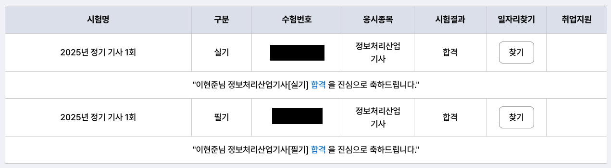
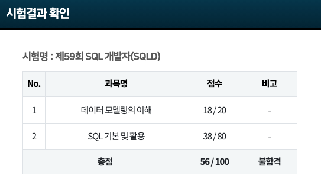
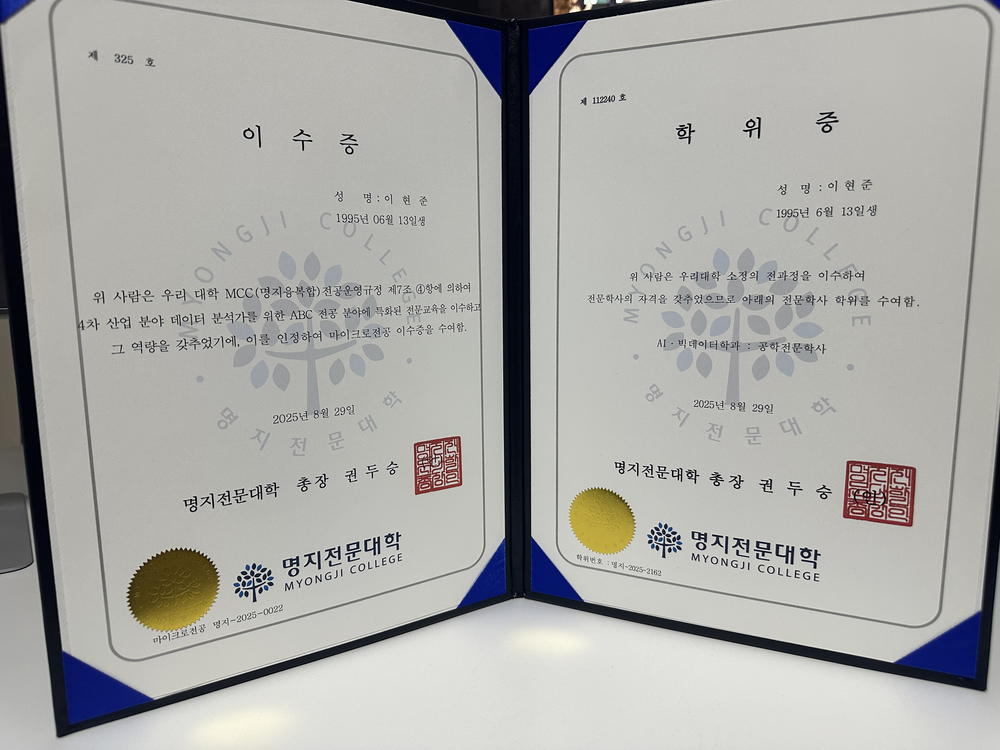
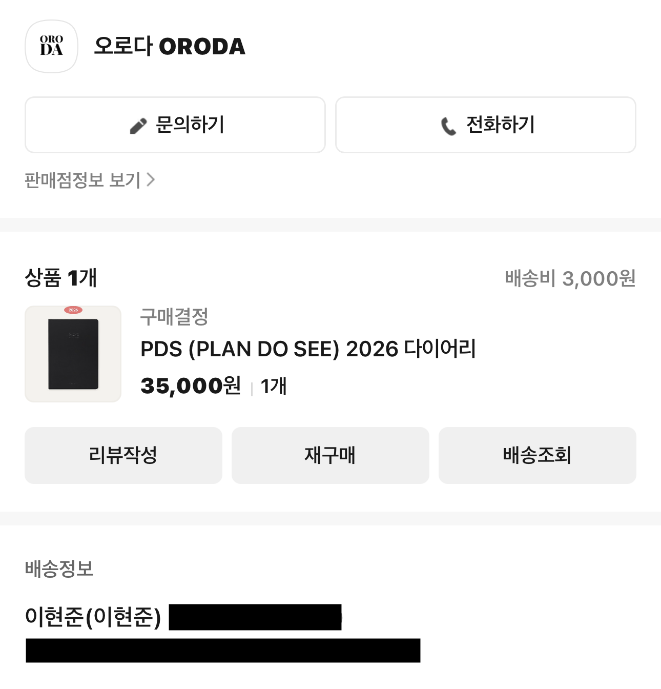

## 2025년을 어떻게 보냈는가
작년 크리스마스에 2024년을 돌아보는 글을 작성했던 적이 있었다.
[[크리스마스에 작성하는 2024 돌아보기]]

해당 글을 보면 2025 목표로
* 풀스택을 위한 백엔드 공부
* 4년제 학위 취득 시작 (학점 은행제 or 사이버 대학)
* 2달에 한 권씩 독서

이렇게 세 가지를 작성했었다.

공부는 꾸준히 하면서 블로그 글도 작성을 했지만, 독서는 제대로 진행하지 못했고 학위 과정은 아직 지원 기간이라 시작하지 못한 상태이다.
현재 열심히 대학 지원서를 작성하고 있기 때문에, 이 역시 곧 결과가 나오지 않을까 생각하고 있다.

**한 해를 뒤돌아보며 어떻게 지냈는지와 앞으로 어떻게 지낼지에 초점을 맞춰보았다.**

## 개발자 취업의 위기
나는 조기취업계약학과를 다녔는데, 입학 시 취업할 회사와 면접을 본 후 1년동안 공부를 진행하고 25년 3월에 입사하게 되는 프로세스였다.

25년 2월, 입사를 약 한 달 남겨둔 시점에 입사 예정이었던 회사가 **회생 신청**했다는 소식을 교수님들 통해 듣게 되었다.
IT 업계가 어렵다는 이야기는 많이 들었지만, 규모가 꽤 있는 회사에 속했기 때문에 전혀 예상하지 못했었다.

24학번으로 입학하며 약 1년 동안 취업을 목표로 달려왔던 터라, 갑작스러운 소식을 접하고 나니 어떻게 해야 할지 막막했다.

교수님과 상담을 진행하면서도, 교수님께서는 "일단 다른 곳을 알아볼테니 조금만 더 버텨보자" 라는 말씀을 해주셨다.

3월에 새 학기를 다니면서도 공부는 손에 잡히지 않았고, 막막함만 앞섰다.
그러던 중 교수님의 추천으로 한 회사에 면접을 보게 되었고 지금 다니고 있는 회사에 합격하게 되었다.
## 신입 개발자로서의 출근
**2025년 3월 12일**, 첫 출근을 하게 되었다.

기존에 하던 영상 PD일을 23년 4월 말에 그만두었으니, 근 **2년 만에 회사에 신입으로 첫 출근**하게 되었다.

함께 일하게 될 동료 개발자분들과 간단히 인사를 나누고 회사 인트라넷 계정을 만들었다.
이후 인사팀 대리님께 회사 내부를 안내받았는데, 그날 하루는 정말 정신없이 지나갔다.

금요일 저녁과 토요일에는 학교에 출석해 마지막 한 학기를 채워야 했고, 앞으로 해야할 과제도 많이 남아 있었지만 그래도 취업을 할 수 있음에 감사했던 것 같다.

약 한 달간의 수습기간을 거친 뒤, 나는 회사 내의 약 15~20년된 ERP 프로그램을 **Vue와 Spring**으로 재개발 하는 프로젝트에 투입되었다.

ERP 특성상 개발 자체가 어렵다기보다는 비즈니스 로직을 이해하는 것이 중요했고, 그만큼 상사분께 질문을 정말 많이 드렸던 것 같다.

**입출고, 약정, 정산 등** 회사의 프로세스를 익히는 일은 쉽진 않았지만, 최대한 즐기면서 업무에 임하려고 노력했다.

현재는 현업 분과 데이터 마이그레이션이 막바지에 접어들었고, 동시에 다른 모듈 작업도 진행중 이다.

비개발자인 현업 분의 입장에서 **어떻게 설명을 해야 이해하기 쉬울까**를 항상 고민하며 소통했던 것 같다.
이 부분에서는 전에 영상 PD로 일하며 쌓았던 커뮤니케이션 경험이 큰 도움이 되었다.

내년에도 ERP는 지속적으로 진행할 것 같지만, 다른 프로젝트에도 참여해보고 싶다는 소망을 가져본다.
## 자격증
올해 도전한 자격증은 정보처리산업기사와 SQLD, 2가지였다.

정보처리산업기사는 취득했고, SQLD는 아쉽게도 불합격했다. (CKAD는 내년에 응시할 예정이라 제외했다.)

정보처리산업기사는 2월에 필기, 4월에 실기 시험을 보았다. 필기와 실기 모두 시험 전날 밤에는 밤샘을 하며 공부했던 기억이 난다.
어느 정도 합격할 수 있겠다는 생각은 있었지만, 혹시 모를 불안감에 밤샘까지 하면서 준비했던 것 같다.

SQLD는 11월에 시험을 봤다. 정보처리산업기사 시험 이후에는 학교 졸업이 우선이었기 때문에, 약 8월까지는 퇴근 후 졸업 과제를 진행하느라 시간을 내기 어려웠다.
졸업 후 시험 일정에 맞춰서 공부를 진행했지만, 4점차이로 불합격했다.. 1과목에서는 큰 문제가 없었지만, 2과목인 SQL 기본 및 활용에서 우수수 틀렸다.

정보처리산업기사를 비교적 넉넉하게 합격했던 터라 조금 자만했던 것도 있었고, SQL을 실무에서 계속 사용하니 괜찮을 거라 생각했던 것이 오산이었다.

결과를 보고 꽤 충격을 받았고, 조금 더 열심히 준비하지 못한 점이 아쉬움으로 남았다.
그래도 핑계를 대기보다는 다시 도전해 2트에는 꼭 합격하길 기대해본다.
## 학교 졸업
24학번으로 입학한 학교를 졸업했다.

앞서 말했듯 조기취업계약학과 특성상, **25년 3월(2학년 1학기)부터 졸업 직전인 7월 까지 직장과 학교를 병행해야했다.**
금요일과 토요일에만 등교하는 일정이었지만, 금요일 오후 4시에 퇴근 후 밤 10-11시까지 학교에 있는 일정은 결코 쉽지 않았다.

졸업 요건을 맞추기 위해 개발 공부와 논문 작성 등 여러 과제를 병행해야 했지만, 어찌저찌해서 제주도 학회 참석까지 마치고 무사히 졸업할 수 있었다.

나에겐 얻어가는 것이 더 많았던 두 번째 학교생활이었지만, 다시 하라고 하면 절대 못 할 것 같다.

## 오프라인 활동
이전부터 오프라인 활동에 대한 갈증이 있었고, 졸업 후 퇴근 시간이 여유로워지면서 OSSCA와 개발자 커뮤니티 HOCO에 참여하게 되었다.
OSSCA 참여 후기는 [오픈소스 컨트리뷰터 아카데미 참여 후기](https://joonda.github.io/blog/retrospect/pytorch-tutorial-translation-contribute) 에 따로 작성했는데, 개인적으로 굉장히 뿌듯한 경험이었다.

HOCO에서는, 오프라인 모임, 팟캐스트, 커피챗 등을 통해 내가 몰랐던 새로운 것들을 많이 배울 수 있었다.
질문하면 정말 친절하고 명확하게 답변해 주시고, 모르는 부분을 거리낌 없이 물어볼 수 있다는 점이 나에겐 큰 장점으로 느껴졌다.

혼자서는 쉽게 접하기 어려운 다양한 분야의 개발자들과 교류하며, 매주 조금씩 시야가 넓어지고 성장하고 있다는 느낌을 받을 수 있었다.
[HOCO 커뮤니티 홈페이지](https://hoco.kr/) 에도 관심있다면 한 번쯤 추천하고 싶다.

## 운동
영상 PD 일을 그만둔 이후 진로에 대한 고민으로 극심한 스트레스를 받았고, 폭식으로 이어져 인생 최고 몸무게를 찍었다.
24년에 학교에 입학하며 운동을 조금씩 시작했고, 25년 3월 취업 이후 4월부터는 본격적으로 주 4-5회 운동을 이어가고 있다.

체중의 드라마틱한 변화는 없었지만, (<del>세상엔 먹을 것이 너무 많다..</del>) 척추측만증으로 인한 허리 통증이 눈에 띄게 개선되었다.
점점 무거운 무게를 들 수 있게 되면서 성취감을 느꼈고, 러닝을 통해 체력도 많이 좋아졌다.

## 내년의 목표
현재 생각한 내년 목표는 다음과 같다.

* 5km 마라톤 완주
* 체지방률 약 8% 감소
* SQLD, CKAD 자격증 취득
* 학사학위 취득 진행
* 블로그 격주 1회 작성
* Spring Batch, Kotlin 학습
* 하루 20분 이상 영어 공부

정리해보니 꽤 많아 보인다.

그래서 난생처음 다이어리를 구매했다.

모바일 기기로 기록할 수단은 많지만, 손으로 직접 쓰는 기록은 확실히 다르다고 생각했다.
현재 다이어리에 내년의 목표를 정리해 두었고, 목표가 추가되면 계속 업데이트할 예정이다.

## 마무리 하며
회사 송년회 자리에서 상사분이 "올해 고생 많았다" 말씀해 주셨다.
지나가는 말일 수도 있지만, 나에게는 꽤 의미 있게 다가왔다.

팀 내에서 자바 개발자로 거의 혼자 개발을 하다 보니, 무엇이 맞고 틀린지 헷갈릴 때도 많았고 허둥대는 순간도 많았다.
그럼에도 긍정적인 생각으로 받아들이기, 적당한 정신승리, 비교하지 않기라는 나만의 기준을 가지고 한 해를 버텨왔고 내년에도 이렇게 버틸 생각이다.

내년에는 열심히 자기개발하고, 열심히 운동하고, 열심히 쉬기도 하는 그런 2026년을 보내고 싶다.