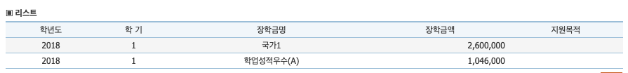
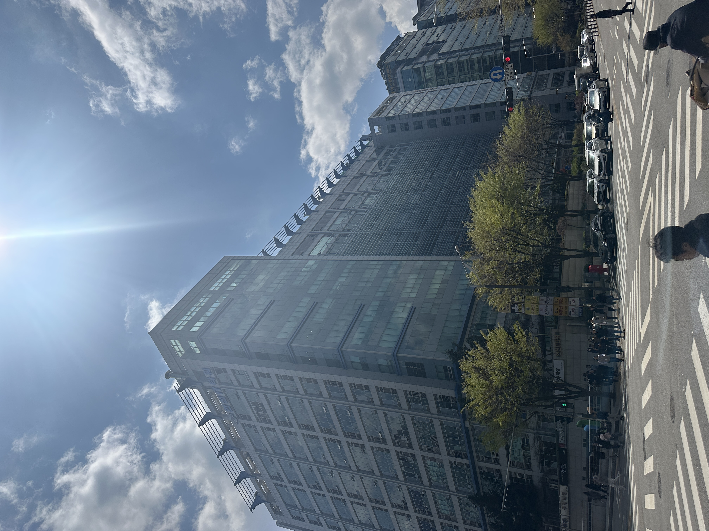

# 새로운 시작
3월 초에 입사하여 3개월 간의 수습기간을 거쳐 7월 1일, <b>정규직 전환 계약</b>을 진행했다.
미리 준비된 계약서에 사인만 하면 되는 과정, 크게 대단할건 없었으나 기분은 좋았다.

높아진 연봉때문이 아니라 <del>(물론 없다고는 할 순 없지만..)</del>, 나름의 인정은 받고있는 것 아닐까? 라는 생각이 들어서였다.
19년에 처음 영상 조연출로 사회생활을 시작했던 나였지만, 25년 다시 시작한 신입 생활은 그리 나쁘진 않았다.
내가 원하는 일을 하고 있어서 그런걸까 ?

# 그럼 이전엔 뭘 했는데?
나는 동아방송예술대학교 14학번이다. 군대를 다녀왔고 복학 후 매일 같이 열심히 영상을 만들며 성적장학금도 받았다.

그렇게 열심히 학교생활을 하면서 교수님 추천을 받아 2019년 졸업과 동시에 칼같이 취업했다. 당시, 내 친구들에 비해 정말 빠르게 취업을 해서 친구들에게 술도 몇 번 사던 기억도 난다.

그렇게 19년 1월부터 약 4년간 영상업계에 종사하면서 점점 안 맞다는 생각이 점점 더 커지게 되었다.  
고민을 지속하다가 23년 5월, 퇴사를 하고 다시 학교를 들어가게 되었다. 중간 과정이 많이 생략된 것 같지만, 모든 것을 서술하기엔 글이 너무 길어지기에 나중에 서술하겠다

# 그래서 지금은?
현재 회사에서는 <b>사내 ERP 프로그램</b>을 개발하고 있다. 입사는 3월 초에 했지만 본격적으로 프로젝트에 투입된 건 4월 중순 ~ 말 부터 였다.
입고, 출고, 정산, 마감, 약정 등 다양한 업무 프로세스를 이해하고 도메인 지식을 쌓아나가는 과정이 쉽지 않았지만, 그래도 상사분이 너무 친절하게 잘 알려주셨고 알아가는 과정이 재밌게 느껴졌다. 

그리고 제일 좋은 경험은 바닥부터 하나씩 개발해나가는 경험을 쌓는 것은 나 같은 초심자에겐 너무나도 중요한 경험이기에 항상 감사하며 개발을 하고 있다. 

# 마무리
개발자라는 직무를 다시 시작한 다음 지인을 만나는 자리마다 항상 늘 들었던 이야기는 영상했던 4년이 아깝지 않냐, 다시 시작한 것에 대해서 대단하다고 얘기해주는 지인 등 다양한 반응이 있었다. 
10년 지기인 대학 동기는 `난, 너 영상에 뼈를 묻을 줄 알았어.` 라는 말까지 했다. 그만큼 나도 나름 열심히 했다는 거겠지.

그만큼 열심히 했기에 그만둘 때 후회는 없었고 미련없이 새롭게 시작할 수 있었던 것 같았다. 새로운 시작을 하는 만큼 더욱더 열심히 정진해야겠다. 앞으로의 1년도, 또 그 다음도 기대가 된다.
